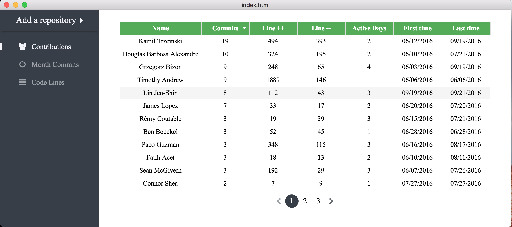

#Static Git

通过图表化方式显示 Git 的历史记录，参考：[gitstats](http://gitstats.sourceforge.net/examples/gitstats/index.html)

- Vuejs-2.0
- Electron
- Nodegit
- chart.js
- webpack
- ES6(babel)

Trello: [Static-git](https://trello.com/b/UOimv6sJ/git-stats)

